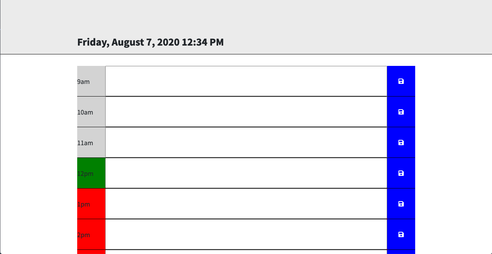

# Work-Day-Scheduler

I created a work day scheduler that allows the user to enter input in time slot. 

The input is saved in local storage. Current date is displayed on top of the page with moment.js. 

Colour of time slots changes depending on the time of the day. 

# Links

https://pierreparientedimitrov.github.io/Work-Day-Scheduler/
https://github.com/PierreParienteDimitrov/Work-Day-Scheduler

# screenshots

